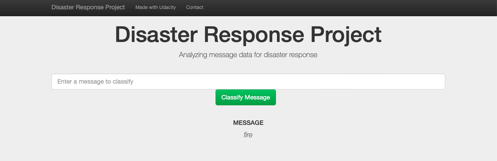
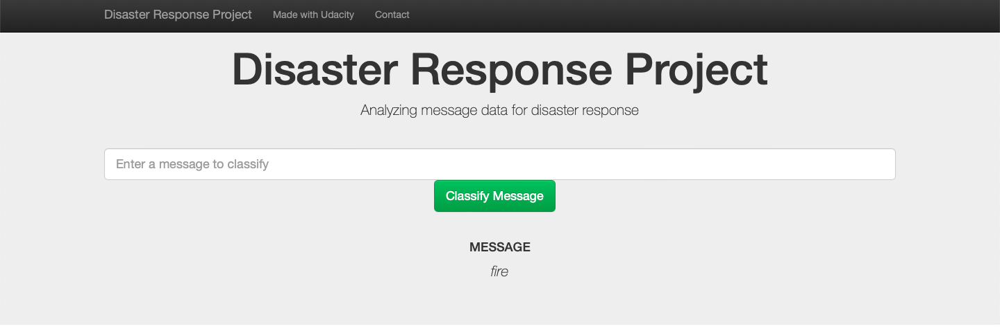
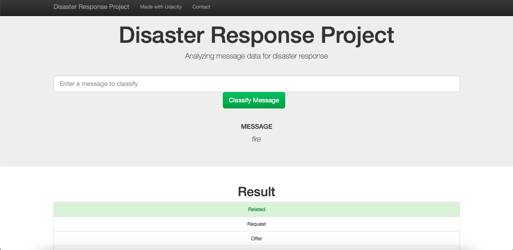
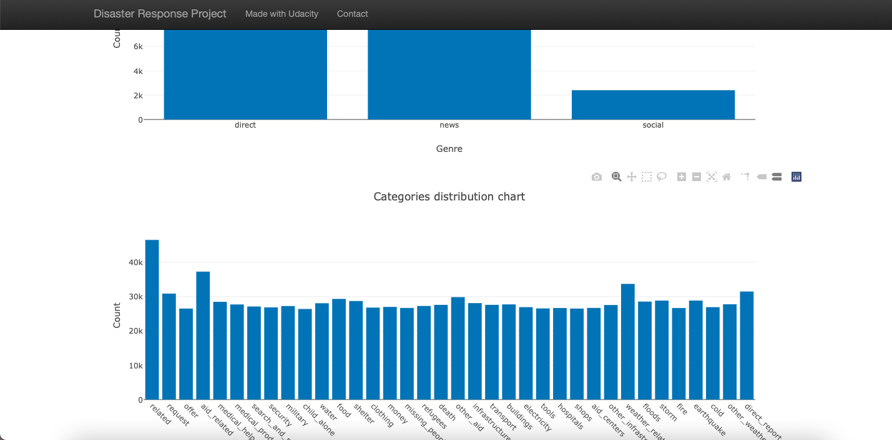
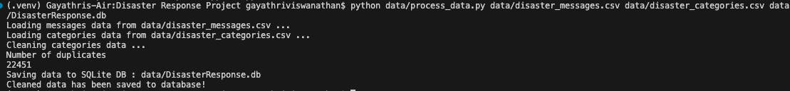
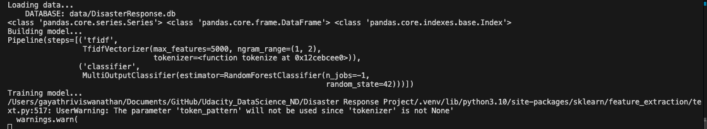
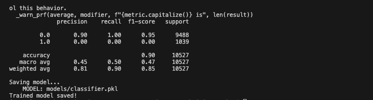

## Udacity Nano Degree - Disaster Response Pipeline project

#### Table of Contents

- [Udacity Nano Degree - Disaster Response Pipeline project](#udacity-nano-degree---disaster-response-pipeline-project)
    - [Table of Contents](#table-of-contents)
  - [Project Description](#project-description)
  - [Getting Started](#getting-started)
    - [Dependencies](#dependencies)
    - [Execution](#execution)
      - [Authors](#authors)
      - [Acknowledgements](#acknowledgements)
    - [Screenshots](#screenshots)

### Project Description
This Project is part of Data Science Nanodegree Program by Udacity in collaboration with Figure Eight. The dataset contains pre-labelled tweet and messages from real-life disaster events. The project aim is to build a Natural Language Processing (NLP) model to categorize messages on a real time basis.

This project is divided in the following key sections:

Processing data, building an ETL pipeline to extract data from source, clean the data and save them in a SQLite DB
Build a machine learning pipeline to train the model which can classify the incoming text message into various categories
Run a web app which can show model results in real time

### Getting Started

#### Dependencies
Python 3.9
Data Processing libraries: Pandas, re,
Machine Learning libraries: NumPy, SciPy, Sciki-Learn
Natural Language Process libraries: NLTK
SQLlite Database libraries: SQLalchemy
Model Loading and Saving library: Pickle
Web App and Data Visualization: Flask, Plotly

#### Execution
1. Install the github repository by running the Git clone command as below.
`git clone https://github.com/Prasanna23/Udacity_DataScience_ND.git`

1. Run the following commands in the project's directory to create the database, train and save the model.

To run ETL pipeline to clean data and store the processed data in the database 
`python data/process_data.py data/disaster_messages.csv data/disaster_categories.csv data/disaster_response_db.db`
To run the ML pipeline that loads data from DB, trains classifier and saves the classifier as a pickle file 
`python models/train_classifier.py data/disaster_response_db.db models/classifier.pkl`
Run the following command in the app's directory to run your web app. 
`python ./app/run.py`

Go to http://192.168.1.157:3000 or http://127.0.0.1:3000 to view the app in your browser.

There are two Jupyter notebooks present in the repository which contains the details on how the data is cleaned and built into a database, how the model is built and how the different models were tested and chosen based on different performance attributes.
[ETL Pipeline Preparation.ipynb](<ETL Pipeline Preparation.ipynb>)
[ML Pipeline Preparation.ipynb](<ML Pipeline Preparation.ipynb>)

data/process_data.py - ETL script for cleaning and load the data into DB
models/train_classifier.py - Machine learning pipeline that loads the database file, trains on the data and predict the new message classification.
app/run.py - Script to run the Flask web app.

##### Authors
Prasanna  Balasubramanian

##### Acknowledgements
Udacity for providing an amazing Data Science Nanodegree Program
Figure Eight for providing the disaster response dataset to train the model

#### Screenshots
Webapp sample input page 

Clicking the classify button classifies the incoming message into categories

Overview of the training dataset

Sample output from running the python ETL and ML scripts.

