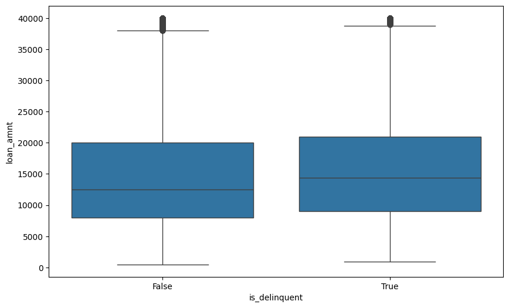

# Exploring Loan Delinquency with Data-Driven Insights

A deep dive into Lending Club's data to uncover trends in loan performance, borrower behavior, and regional variations.

---

## Introduction
- As part of my Udacity Data Scientist Nanodegree program, I explored Lending Club's approved and rejected loans dataset available on Kaggle. My goal was to uncover actionable insights that benefit both lenders and borrowers. Borrowers can learn strategies to improve their loan approval chances, while lenders gain a better understanding of which loans are likely to succeed.

- The dataset was already well-prepared, so minimal preprocessing was required. However, I excluded loan records with missing data for critical variables to ensure the analysis remains accurate and unbiased. The dataset includes over 150 features for approved loans and around 10 features for rejected loans.

- To focus my analysis, I first conducted an exploratory data analysis (EDA) to identify trends and patterns. Building on these findings, I delved into geographical and borrower-specific factors to examine their impact on loan performance and delinquency.

---

## Delinquency Analysis
### Data Exploration
- Exploring the LC loan data helps us to understand the nature of the accepted/funded loans.
- I wanted to look at the loans which are in one of the default statuses (***Late (31-120 days), Late (16-30 days), Charged Off, Default***). These statuses tells us that the loan is not in good standing.
    
- By grouping different default status into one will give us a clear picture on what percentage of loans are defaulted. This is done by creating a new column "is_delinquent" and setting it to True if it has one of the default statuses. This shows that approximately 15% of the loans are delinquent. 
    
- Looking closely at the delinquent loans, I wanted to see if there are any specific loan characteristic that drives the delinquency rate. 
- Loan delinquency happens across all loan amount ranges but they're more prevalent around loan amounts of $10k which is seen in the density plot. 
  
- The loan amount spread is from $500 to $40K, plotting a box plot on loan amount vs delinquency status we can find out that 50% of the delinquent loans are having loan amount range of $8K-20K but this doesn't give us any concrete insights as 50% of non delinquent loans also fall under the same loan amount range.
   
- Continuing with the exploration, I wanted to check if any loan amount ranges see uptick in delinquency rates. It does show that the lower loan amounts have less deliquency rates but there's no conclusive evidence here and we will have to check the impact of other variables such as geography, credit worthiness of borrowers and interest rates at which loans are made.
   

### Geographical Analysis
- We have borrower domicile data such as State and three digit zipcode available in the dataset. This can help us to analyze and see if there is any geographical trend exists in this dataset. This analysis will help to identify if there are any states where Lending club has more business penetration than other states in US.
- The top 5 states where most of the loans are underwritten are CA,NY,TX,FL,IL
  | State | Number of loans|
  | --- | ---|
  |CA   | 314533
  |NY   | 186389
  |TX   | 186335
  |FL   | 161991
  |IL   |  91173
- To indentify where the bulk of delinquencies happen, choropleth map using the number of delinquent loans is helpful. 
  
- Data and map shows that higher delinquency rates are common in sun belt states except TX, another outlier is NY with higher rates of default. Maine & Iowa states have low delinquency rates.
***Highly delinquent states***
    | addr_state|  is_delinquent|     loan_amnt|   int_rate|
    | --- | --- | ---| ---|
    |  ==AL== |     ==15.741827==|  14686.235523|  13.567154
    |    ==MS==|      ==15.483820==|  14750.150328|  13.445814
    |   ==AR==|      ==15.444536==|  14094.558979|  13.354703
    |     OK|      15.219177|  15014.517181|  13.263297
    |    LA|      15.155868|  14831.564696|  13.224466|
    |   NV |     14.640047|  14397.075665|  13.205397
    |    NY |     14.317905|  14846.158840|  13.260060
    |  NM   |   14.233272 | 14874.063491|  13.155975
    |  FL   |   14.020532 | 14402.247656|  13.164735
    |  HI   |   13.957630 | 15894.460067|  13.786782
***Low delinquency states***
|addr_state|  is_delinquent|     loan_amnt|   int_rate
| --- | ---| --- | ---|
|==ME== |      ==6.453559==|  14740.756936|  12.817557
|==IA==  |     ==7.142857==|   8148.214286 | 12.631429
|46  |       VT|       8.426170 | 13815.429411 | 12.986204
| ID  |     8.588672|  14412.354921|  13.295014
| DC  |     9.447349 | 15815.393951 | 12.578114

- I wanted to see how the average low amount value will vary by State and see how the loan amount stacks up for high and low delinquency rate states.
- By plotting another choropleth graph we can observe that average values are higher in Alaska, Virginia and Hawaii whereas it's low in Iowa, Vermont and Montana
  
- Iowa is a standout here, we have low delinquency rates and low average loan amount of 8K, As a lender, you can say that it's safe to fund a loan within 8K and be confident that 90% of the time it will be repaid without default. 
- Vermont closely follows IA but the loan amount average is not low like IA, it's impresssive to have low delinquency although the loan amount average is not so low. 
- Washington DC is another standout region, which is in top list of low delinquency rates and also making it to the top of the loan amount too. 
- It's very safe to fund a loan originating out of DC than TX or NJ or HI.
***High loan amount averages***

|addr_state |  is_delinquent |     loan_amnt |   int_rate
| --- | --- | --- | --- |
|AK |     13.171478|  17285.394762|  13.326289|
|        VA|      13.222353|  16091.366315|  13.113697
|    HI|      13.957630 | 15894.460067|  13.786782
|      MD |     13.696119 | 15865.862465 |  13.236114
|        NJ|      13.443680|  15832.747618 | 12.989854
|        ==DC== |      ==9.447349== | ==15815.393951== | 12.578114
|     TX|      12.907398|  15730.450667|  12.999444
|      MA|      12.472965|  15675.628090|  12.676827

***Low loan amount averages***

|addr_state|  is_delinquent|     loan_amnt|   int_rate|
| --- | --- | --- | --- |
|        ==IA== |      ==7.142857== |  ==8148.214286==|  12.631429
| ==VT== |       ==8.426170== | ==13815.429411== | 12.986204
|       MT |     11.081124 | 13997.590887 | 12.956177
|   AR |      15.444536 |  14094.558979 |  13.354703
|       OR  |     9.671880 | 14165.025757 |  12.954578

#### Interest rate analysis by state
- Average interest rate is stable across US states with low being 12.6 and high being 13.8
- Interest rates in DC, IA, MA & NH are in the lower end of the spectrum whereas it's in the higher end for HI, AL, MS & AR
  

- Some of the high deliquent rate states are in the list for high interest rates as expected. 
- Apart from state, we have three digit zip code information available in the dataset. This shows us that there are some zip codes which looks ultra safe and some are very risky from data. 
  ***Zip codes with high delinquency rates***

| is_delinquent | loan_amnt |   int_rate | 3_dig_zip |
 | --- | --- | --- | --- | 
| 100.000000  |12000.000000|  11.440000|       513
|   100.000000 |  21000.000000|  18.240000   |    516
| 100.000000 | 12000.000000 | 14.490000    |   524
|100.000000|  15000.000000|  18.250000 |      568
|   100.000000|   9750.000000|  15.800000 |      643
| 100.000000|   7000.000000|   6.990000|       682
| 100.000000 | 13500.000000 | 13.980000|       889
|    100.000000|  15000.000000|  20.990000|       938

***Zip codes with low delinquency rates***
| is_delinquent|     loan_amnt|   int_rate| 3_dig_zip
 | --- | --- | --- | --- |
|0.0  |14812.500000|  16.355000|       009
|0.0 | 16000.000000|  13.990000 |      055
| 0.0 | 16244.230769|  13.610769 |      092
|    0.0|  19960.000000|  15.442000|       093
|   0.0 | 21433.333333|   9.080000|       095
|0.0 | 12500.000000|   6.990000|       202
|      0.0|  14500.000000 | 13.990000 |      269
|0.0 |  18555.555556 | 14.174444 |       340
|    0.0|  21000.000000|  12.914000|       348
| 0.0 |  2100.000000|   9.990000|       375

- Looking closely into the data shows us that these ultra safe(137 loans) and risky areas(8 loans) don't have a lot of loans disbursed and infact they're incomparable to the dataset volume.
  
### Borrower analysis

#### Objectives

- Geographical analysis gave great insights on market penetration and the impact of geo variables in the default rate.
- Moving from there, analysis on borrower data can help us understand what data points will make sure that the loan get approved and funded, what are some data fields to look for before approving to avoid defaults from the lender standpoint.
  
#### Data
- I'm going to use approved and rejected loan data to draw some insights on the objectives discussed above.
  
#### Insights

- Violin plots on the loan amount shows how the data is spread out when it's delinquent or based on loan term. But this doesn't give us any new or enough information to conclude anything.
- Loans with higher interest rates in general have higher delinquencies
- Delinquency odds can be visualized by combining loan amount, loan grade and deliquencies using heat map.
  
- Delinquency rates increase with grade and loan size due to lower borrower creditworthiness and repayment capacity.
  
- Debt income ratio and annual income has profound impact on loan status like the loan grade. We can see that DTI increases with loan grade depreciation and annual income goes down too. Interesting the loan grades E,F,G have similar mean annual income and DTI. This makes it clear that higher loan values for grade E,F & G and inherently risky due to their lower repayment capacity
  
- With closer eyes, it's evident that fundability index is high such that if you get the loan approved, you can be almost certain that the loan will be fully funded. This is why rejected loans data is more important to figure out on what qualities are required for loan approval.
  
- Applications with lower risk scores are getting rejected even for smaller loan amount requests.Better risk scores improve the approval odds but only until the requested amount is less than 10K. Beyod 10K rejections creep up even with better score.
  
- DTI data gives additional information on rejections.Low score profiles carry huge DTI and on the other side of the spectrum the better risk score profiles carry heavy debt too which could be the reason why larger loan amounts are getting rejected here.
  

#### Conclusion
- Higher risk score with lower DTI and annual income to support the loan request will strike gold as lenders will have trust over the lenders repayment capabilities even during an economic turmoil. 
- Lending club got greater market penetration in California, New York and Texas. 
- Loan defaults are more prevalent in sun belt states and State of NY. Delinquency rates are very low in Maine and Iowa.
- Zip code analysis can be extended to see which Zip codes are doing well and not.
- This analysis underscores the importance of combining regional, borrower, and macroeconomic data for informed lending. By incorporating these insights, lenders can design strategies that mitigate risk while expanding access in underserved regions. Future studies could enhance this by analyzing temporal trends or external factors such as economic shocks

#### Acknowledgements:
Lending Club Kaggle dataset from the below link 
https://www.kaggle.com/datasets/wordsforthewise/lending-club

  

